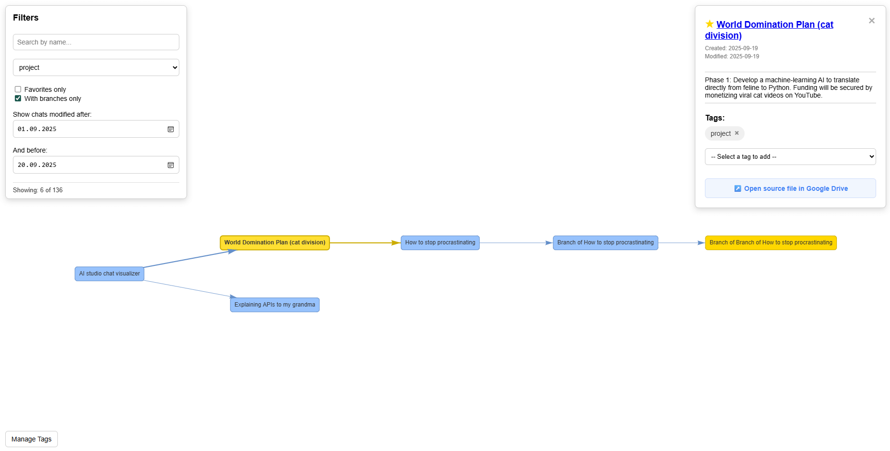

# AI Studio Chat Visualizer


> While working extensively with Google AI Studio, I found it difficult to keep track of dozens of branching conversations. This tool was created to solve that problem by providing a clear and convenient way to navigate the tree of my ideas.

A visualizer for Google AI Studio chats that helps you track and organize branching conversation trees.

This tool reads your chat history from the "Google AI Studio" folder on your Google Drive, builds an interactive graph of the relationships between them, and provides powerful tools for filtering, searching, and organizing with tags.



## 🚀 Features

*   **Interactive visualization:** All chats are displayed as a graph where you can move nodes and zoom.
*   **Link integrity:** Automatically restores connections between parent and child branches, even if there are inconsistencies in the AI Studio data.
*   **Powerful filtering:**
    *   Real-time search by name.
    *   Filter by tags from a dropdown list.
    *   Display only favorite chats.
    *   Display only chats that have branches.
    *   Filter by last modification date.
*   **Tagging system:**
    *   Centralized management of all tags through a convenient modal window.
    *   Assign tags to any chat from the existing list.
*   **Favorites:** Mark important chats with a star for quick access.
*   **Full chat details:** A side panel displays the title, description, creation/modification dates, and a list of tags for each chat.
*   **Quick source access:** A direct link from the side panel to the chat file in Google Drive for easy management.

## 🔒 Privacy & Security

Your data privacy is the highest priority. This application is designed with a "your data is your own" philosophy.

*   **Runs entirely locally:** The application runs **100% on your local machine**. Your data never leaves your computer and is not sent to any third-party servers.
*   **Direct Google Authentication:** The login process occurs directly between your computer and Google. No intermediary servers are involved.
*   **Local storage:** All processed information—the chat map, your list of favorites, and your tags—is stored in simple JSON files within the project folder on your own disk.
*   **Fully Open-Source:** You can review the code yourself to verify that it performs no hidden actions to send your data online.

## 🛠️ Setup & Installation

### Step 1: Configure the Google Drive API

Before the first run, you need to obtain credentials to access your Google Drive.

1.  **Go to the [Google Cloud Console](https://console.cloud.google.com/)**.
2.  **Create a new project** (e.g., "Chat-Visualizer").
3.  **Enable the "Google Drive API"** for this project (use the search bar at the top).
4.  Navigate to **"Credentials" -> "+ Create credentials" -> "OAuth client ID"**.
5.  If prompted, configure the "OAuth consent screen":
    *   Give your application a name and enter your email.
    *   User Type: **"External"**.
6.  Return to creating credentials:
    *   Application type: **"Desktop app"**.
    *   Give it a name and click "Create".
7.  **Download the JSON file** with your credentials. **Rename it to `credentials.json`** and place it in the root folder of the project.
8. In the "OAuth consent screen -> Audience" section, either exit testing mode by clicking **"Publish App"**, or remain in test mode and add your own email address under **"Test users"**.

> **Note:** On the authentication screen, Google will show a "Google hasn't verified this app" warning. This is expected. You need to click **"Advanced"** and then **"Go to [Your App Name] (unsafe)"** to proceed. The application only requests read-only access to your Google Drive files.

### Step 2: Clone the repository

```bash
git clone https://github.com/ivanbaluta/aistudio-chat-visualizer.git
cd aistudio-chat-visualizer
```

### Step 3: Install dependencies

It is recommended to use a virtual environment.

```bash
python3 -m venv venv
# For macOS/Linux
source venv/bin/activate
# For Windows
venv\Scripts\activate
```

Install the required Python libraries from `requirements.txt`:

```bash
pip install -r requirements.txt
```

### Step 4: Run the application

**1. Fetch your chat data from Google Drive (run this on first launch and to update):**

```bash
python read_chats.py
```

*The very first time you run this, it will open a browser and ask you to log in and grant permission. A `token.json` file will be created, so you won't need to re-authenticate every time.*

**2. Start the web server:**

```bash
python server.py
```

Then, open your browser and navigate to [http://127.0.0.1:5000](http://127.0.0.1:5000).

## 📖 How to Use

*   **Navigation:** Drag the canvas to pan. Use the mouse wheel to zoom in and out.
*   **View details:** Click on a chat node to open the side panel with detailed information.
*   **Add to favorites:** Click the star icon (☆) in the side panel.
*   **Manage tags:**
    *   Click the "Manage Tags" button to create or delete global tags in the modal window.
    *   In the side panel, select a tag from the dropdown list to assign it to the current chat.
*   **Open source file:** Click the "↗️ Open source file in Google Drive" button in the side panel to navigate to the file on your Drive.

## 📜 License

This project is distributed under the MIT License. See the `LICENSE` file for more details.